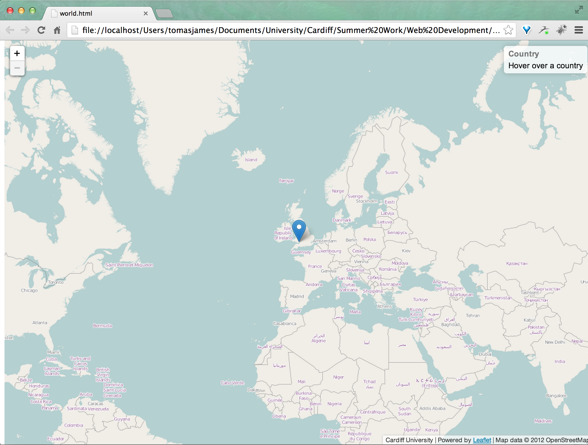

# Global Mapping Applications

This repository contains two folders: Mapbox.js Webpage and LeafletJS webpage. 
They both produce an interactive map of the world using different JavaScript libraries and mapping providers,
though they are all based around similar JavaScript techniques and practices.

Neither script uses HTML5 or CSS3 (or any other bleeding edge language for that matter) to ensure compatibility
with older, now deprecated browsers.

## Differences

The main differences are the JavaScript libraries used to create the map in both cases. Mapbox.js uses mapbox.js and 
LeafletJS uses Leaflet.js. The former runs well under WebKit browsers but falls short under Firefox or IE. 

The latter however works under all browsers. Some versions of Internet Explorer have difficulty in rendering 
the SVG and interactive layer graphics though it still performs amicably under most circumstances and remains
usable throughout. ActiveX controls run through Internet Explorer and these systems will initially block the 
JavaScript content. 

## Data

Data was collected using a survey that was sent electronically to all academics (excluding post doctoral researchers 
and post graduate students) with the aim of surveying the nationalities of Cardiff University's academic staff. It
was also used to obtain data on the number of worldwide collaborative research projects that links Cardiff to other
universities around the world. 

Alumni data was also used to showcase the university's links with undergraduate students from countries across
the globe. This is data valid for academic year 2011/2012 but can be updated to bring it up to speed each year if
necessary. This process is not user friendly and is time consuming in it's present form (manually altering the
JavaScript file containing all of the coordinates). This method will be investigated once all primary work
is complete to determine whether a more user friendly update method can be found.

## Compatibility

These maps were designed around a worldwide user base and as such the possibility of users using older operating
systems (Windows XP for example) that do not support the newest browsers or languages had to be considered. As such
these maps do not use HTML5, or CSS3 (as mentioned above).

Both JavaScript libraries (Leaflet and Mapbox) are external and are loaded into the document from an external source.
To save time these could be hosted on the home server as both libraries are lightweight and single document. 

Through testing it was found that mapbox.js did not run well on any version of Internet Explorer. It ran a somewhat 
better experience under Firefox though lag was present when loading interactive layers. WebKit browsers (Google
Chrome, Safari, Opera etc) handled this application in the most consistent manner.

All browsers tested ran the LeafletJS map with only small problems in Firefox (namely a slight lag if the countriesSmall.js
file is fairly large). Internet Explorer 7 through 9 blocked the JavaScript content under an ActiveX warning. Dismissing this
warning loaded the map and it's interactive layer perfectly.

Internet Explorer 6 was more of a problem. All code used is supposedly compatible with IE 6 however it exhibits erratic
behaviour on occasions. Internet Explorer 6 is stated as being unsupported in LeafletJS documentation however it has been
reported to have been working under some circumstances.

## What To Do When Things Go Wrong

Every effort has been made to test these applications under a wide variety of browsers and ecosystems. Inevitably 
minor bugs may fall through the cracks, at which point further action may need to be taken. 

This ReadMe has been written to help administrators familiarise themselves with the code. Should you not be able
to find the source of the problem please email jamest7@cardiff.ac.uk with a description of the problem, your operating
system and browser along with screenshots (if possible).

