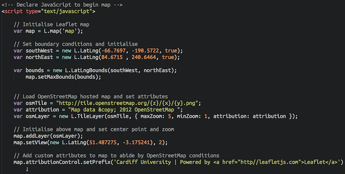
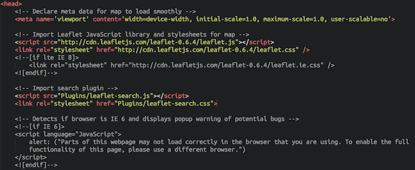
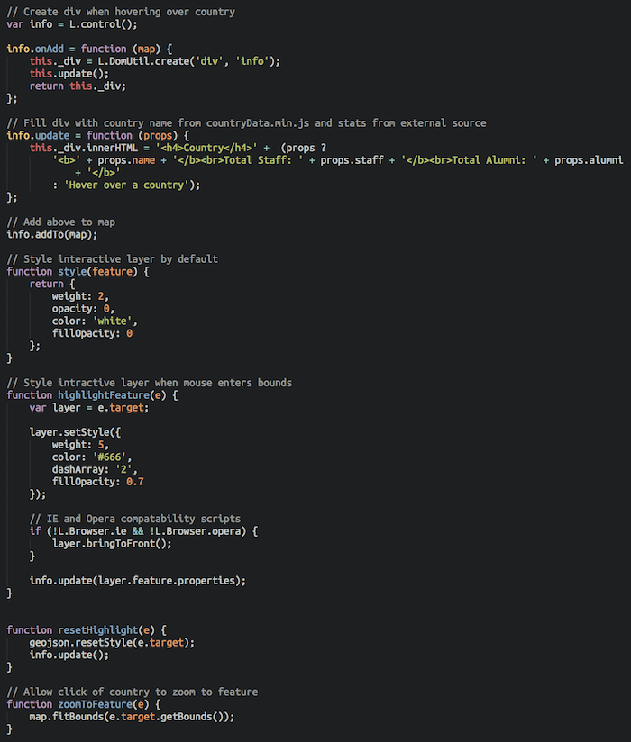
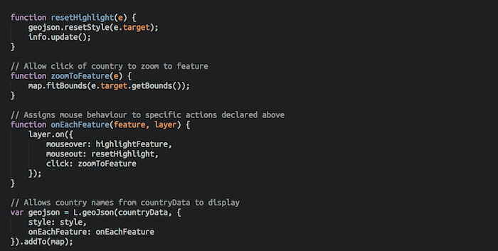

## Global Mapping Applications for Cardiff University

The aim of this project was to create a webpage through which potential international students to Cardiff University could learn more about the university's connections with their home country in an interactive and modern manner. 

The project also served as a method of gathering nationality and collaborative research data for the university's academics to help highlight potential links and trends between Cardiff and other universities/institutes or countries around the world. 

###  The Map

It was decided that the best way to disseminate information was to produce an interactive map, through which a user could explore an atlas style map of the Earth. Hovering over a country would pull in data about the number of staff currently working at Cardiff as well as the total number of Alumni that have studied at Cardiff in the past. 

A similar idea has been implemented by Oxford University (http://www.ox.ac.uk/international/oxford_around_the_globe/). This method works well and is an efficient method of data dissemination, but is not particularly user friendly or quick to use.

### Data

Data was collected using a survey that was sent electronically to all academics (excluding post doctoral researchers 
and post graduate students). 

Alumni data was obtained from the Alumni Office. This Alumni data is valid for academic year 2011/2012 but can be updated to bring it up to speed each year if necessary. This process is not user friendly and is time consuming in it's present form (manually altering the JavaScript file containing all of the coordinates). Efforts to streamline this process will occur in due course.

###  Code

The code to produce the map has been written in HTML, CSS and JavaScript. The main language that produces the map is JavaScript. Care was taken when writing the applet to ensure that it remained as usable and consistent across as many browsers as possible. The user base for the entire web page was assumed to be global, so neglecting older - now deprecated browsers - would have limited the page's reach.

A JavaScript library called LeafletJS was used to produce the map. This library is free to use and is lightweight, meaning it requires very little space to store the files on a server. 

#### Creating the Map

The map itself is produces using a series of interlocking tiles. There are several providers of these services on the web however this 'pilot' applet uses an open source variety called OpenStreetMap. LeafletJS itself has excellent support for custom mapping tiles, so a map designed around the university's aesthetic and principles could be used to replace the detailed OpenStreetMap version used here. Instructions on how to do something similar to this can be found at the following web address: http://omarriott.com/aux/leaflet-js-non-geographical-imagery/.

The map itself is initialised using the following piece of code:

The necessary import scripts are found in this piece of code:

This allows LeafletJS to build a map using tiles defined in osmTile. The variable osmLayer defines the maximum and minimum zoom conditions that the user can move to. The reason for this is that the interactive layer only works within one instance of the map, and zooming out such that more than one instance of the map is visible created confusion as to which was area was 'active'.

#### Interactive Layer

The interactive layer uses openly available coordinate and boundary data from http://www.naturalearthdata.com. This is stored in a .js file, along with country names and the data collected previously (alumni and staff numbers). 

To allow LeafletJS to pull this data in the following code is required:

